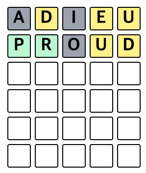
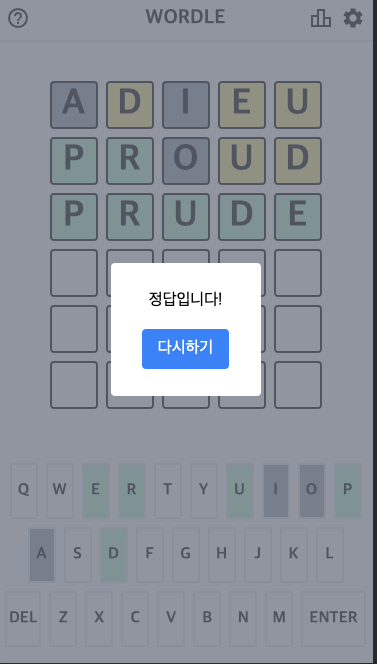

# WORDLE 게임

[게임하러가기](ryanbae94.github.io/wordle)

## 게임설명

5음절의 영단어를 알아맞추는 게임입니다.
예시정답: prude


'd', 'e', 'u', 는 정답에 포함되어 있지만 배열이 다르기 때문에 노란색으로 표시됩니다.



'p', 'r' 은 정답에 포함되어 있으면서 배열도 같기 때문에 초록색으로 표시됩니다.
그 외 'a', 'i', 'o'는 정답에 포함되어 있지 않기 때문에 회색으로 표시됩니다.



총 6번의 시도가 가능하고, 6번의 시도 내에 정답을 맞추게 되면 승리합니다.

install dependencies:

```bash
npm install
```

run:

```bash
npm start
```
