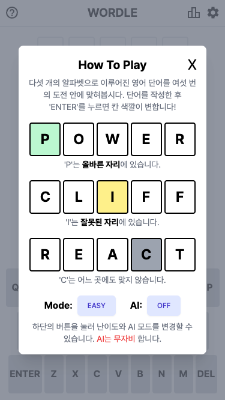
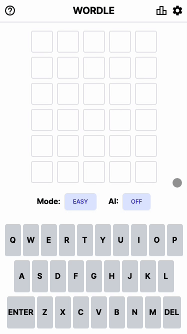
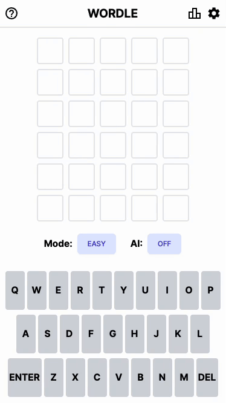

## How To Play



## 일반 플레이



## AI와 플레이



---

[게임하러 가기](https://ryanbae94.github.io/wordle/)

---

### 개발 인원

1인

### 개발 기간

2023.12.25 ~

### 스택

React, TailwindCSS

### 사전 API

Cambridge Dictionary API

---

### 디펜던시 추가

```bash
npm install
```

### 로컬 개발 실행

```bash
npm start
```
